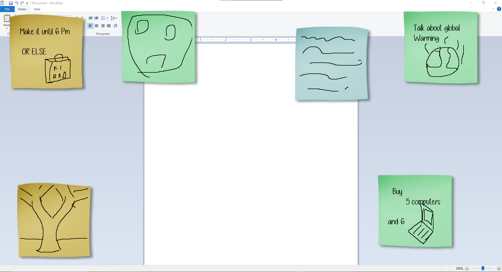

# VNotes

VNotes is a desktop application designed to provide a **realistic sticky notes experience** on Windows. Built with **WPF (Windows Presentation Foundation)**, this app replicates the feel of physical sticky notes with a paper stack UI, enabling users to create, write, and draw on digital sticky notes that always remain on screen.

## Features

### Core Functionality
- **Realistic Paper Stack UI**: Click on the paper stack to create a new sticky note.
- **Sticky Notes Always on Screen**: Notes stay visible even when playing games or using fullscreen applications, simulating real-life sticky notes.
- **Handwriting & Drawing Support**: Write and draw on notes using a mouse, stylus, or touchscreen.
- **Note Locking**: Lock notes to prevent accidental edits or deletion.
- **Erase & Edit**: Use an eraser tool to remove drawings or text selectively.
- **Delete Notes**: Easily remove notes when no longer needed.

- ## Technology Stack
- **Frontend**: WPF (Windows Presentation Foundation)
- **Backend**: C# with .NET 8
- **UI Framework**: Custom WPF components with realistic rendering

## Usage

### Creating a Sticky Note
1. Click on the **paper stack UI** to create a new note.
2. Start writing or drawing directly on the note.

### Managing Notes
- **Lock a Note**: Right-click and select “Lock” to prevent edits.
- **Erase Content**: Use the eraser tool to remove unwanted parts.
- **Delete a Note**: Click the delete icon or press the delete key.
- **Move**: Drag the note around the screen to move it, it will always be visible.
